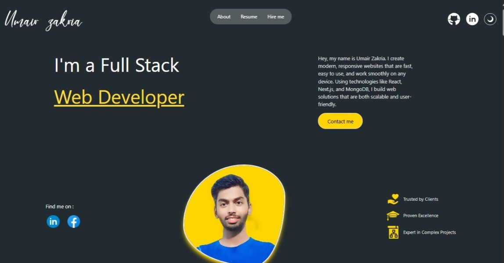

# 🚀 Personal Portfolio Website



A modern, responsive personal portfolio website built with **Next.js 15**, featuring a beautiful UI with dark/light theme support, animated components, and a comprehensive admin panel for content management.

## ✨ Features

- **🎨 Modern Design**: Clean, responsive design with smooth animations
- **🌙 Dark/Light Theme**: Toggle between dark and light modes
- **📱 Fully Responsive**: Optimized for desktop, tablet, and mobile devices
- **⚡ Fast Performance**: Built with Next.js 15 for optimal performance
- **📝 Blog System**: Integrated blog with rich text editor
- **🛠️ Admin Panel**: Complete content management system
- **📊 Project Showcase**: Dynamic project display with filtering
- **📧 Contact System**: Functional contact form with email integration
- **🔐 Authentication**: Secure admin login with NextAuth.js
- **🎭 Animations**: Smooth animations using Framer Motion
- **📈 Analytics Ready**: Built-in analytics and tracking capabilities

## 🛠️ Tech Stack

- **Frontend**: Next.js 15, React 18, Tailwind CSS
- **Backend**: Next.js API Routes, MongoDB
- **Database**: MongoDB with Mongoose ODM
- **Authentication**: NextAuth.js
- **Animations**: Framer Motion
- **UI Components**: Custom components with React Icons
- **Deployment**: Vercel-ready

## 🚀 Quick Start

### Prerequisites

- Node.js 18+ 
- MongoDB database
- Git

### Installation

1. **Clone the repository**
   ```bash
   git clone <your-repo-url>
   cd portfolio-v1-main
   ```

2. **Install dependencies**
   ```bash
   npm install
   ```

3. **Environment Setup**
   
   Create a `.env.local` file in the root directory:
   ```env
   MONGODB_URI=your_mongodb_connection_string
   NEXTAUTH_SECRET=your_nextauth_secret
   NEXTAUTH_URL=http://localhost:3000
   ```

4. **Run the development server**
   ```bash
   npm run dev
   ```

5. **Open your browser**
   
   Navigate to [http://localhost:3000](http://localhost:3000)

## 📁 Project Structure

```
portfolio-v1-main/
├── app/                    # Next.js 15 app directory
│   ├── api/               # API routes
│   ├── Article/           # Blog article pages
│   ├── Login/             # Authentication pages
│   ├── Panel/             # Admin panel
│   └── models/            # MongoDB models
├── components/            # Reusable React components
├── lib/                   # Utility functions
├── public/                # Static assets
└── Pics/                  # Project images
```

## 🎯 Key Features Explained

### 🏠 Homepage
- Hero section with animated text and call-to-action
- Skills showcase with proficiency indicators
- Project portfolio with filtering
- Blog section with latest posts
- Contact form with validation

### 📝 Blog System
- Rich text editor (Jodit React)
- Tag-based categorization
- SEO-optimized URLs
- Responsive design

### 🛠️ Admin Panel
- Secure authentication
- Project management (CRUD operations)
- Blog post editor
- Message management
- Real-time updates

### 🎨 Design Features
- Smooth scroll animations
- Interactive hover effects
- Parallax scrolling
- Loading skeletons
- Toast notifications

## 🔧 Available Scripts

```bash
npm run dev      # Start development server
npm run build    # Build for production
npm run start    # Start production server
npm run lint     # Run ESLint
```

## 📦 Dependencies

### Core Dependencies
- `next`: 15.0.3 - React framework
- `react`: 18.2.0 - UI library
- `framer-motion`: 11.12.0 - Animations
- `tailwindcss`: 3.4.1 - CSS framework
- `mongodb`: 6.11.0 - Database
- `next-auth`: 4.24.11 - Authentication

### UI/UX Libraries
- `react-icons`: 5.4.0 - Icon library
- `react-slick`: 0.30.3 - Carousel
- `typewriter-effect`: 2.21.0 - Typing animation
- `react-countup`: 6.5.3 - Number animations

## 🌐 Deployment

### Vercel (Recommended)
1. Connect your GitHub repository to Vercel
2. Add environment variables in Vercel dashboard
3. Deploy automatically on push to main branch

### Other Platforms
- Netlify
- Railway
- DigitalOcean App Platform

## 🔐 Environment Variables

```env
MONGODB_URI=mongodb://localhost:27017/portfolio
NEXTAUTH_SECRET=your-secret-key-here
NEXTAUTH_URL=http://localhost:3000
```

## 📱 Responsive Design

The portfolio is fully responsive and optimized for:
- **Desktop**: 1025px+
- **Tablet**: 768px - 1024px  
- **Mobile**: 320px - 767px

## 🎨 Customization

### Colors & Themes
- Edit `tailwind.config.js` for color schemes
- Modify `components/theme-provider.js` for theme logic

### Content Management
- Projects: `/Panel/Projects/`
- Blog Posts: `/Panel/Addblog/`
- Messages: `/Panel/Message/`

## 🤝 Contributing

1. Fork the repository
2. Create a feature branch
3. Make your changes
4. Submit a pull request

## 📄 License

This project is licensed under the MIT License.

## 👨‍💻 Author

**Umair** - Full Stack Developer

---

⭐ **Star this repository if you found it helpful!**
